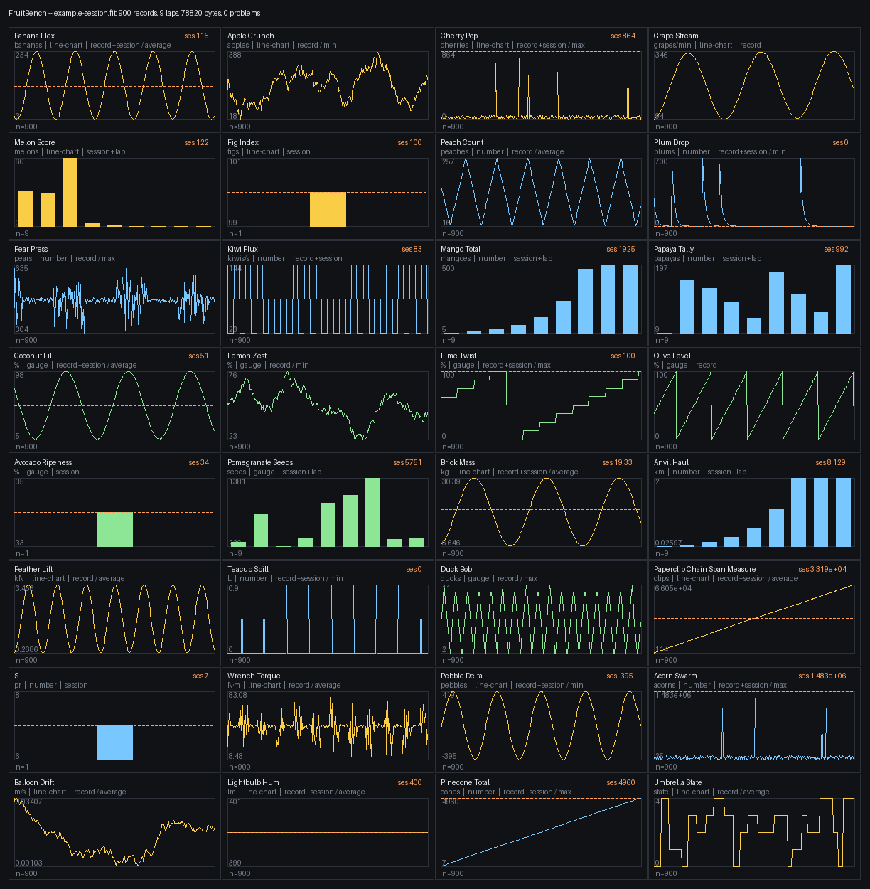

# FruitBench

A benchmark for the UNA Watch **activity** pipeline: manifest → watch →
FIT / activity report → companion charts.

It is a test instrument, not a fitness tracker. One recording exercises every
documented shape of activity data at once, so a watch build, a companion app or
a FIT importer can be judged against the whole surface instead of one metric at
a time. The values are fruit and household objects — bananas, anvils, rubber
ducks — because they mean nothing and a fruit is easier to recognise on a chart
than a fake physiological metric.



*Every chart above came out of `docs/example-session.fit`, which the desktop
test produced from seed `0x51ED27A3` — see [Verifying](#verifying).*

## What it measures

- **32 custom measures** — the platform documents no cap on them, so 32 is
  this app's own ceiling, borrowed from the documented limit on `configFields`.
  Rows 0–17 are an exhaustive
  matrix of every combination of `visualisation` (line-chart, number, gauge) ×
  `isTimeBased` × `preview` × `previewAggregation`. Rows 18–31 each move one
  axis away from the ordinary case: unit scaling factors (×1000 down to
  ×0.001), differing metric and imperial units, a non-ASCII unit string, a
  40-character title, a 1-character title, signed values crossing zero,
  magnitudes up to 1.5 × 10⁶, tiny floats, a perfectly flat series, monotonic
  counters and a sparse step series. The full table is
  [docs/measures.md](docs/measures.md).
- **All the predefined metrics too** — laps, distance, speed, heart rate,
  elevation, steps and a GPS track — so the standard half of the pipeline is
  covered by the same recording.
- **Six FIT base types** across the developer fields (uint8/16/32, sint16/32,
  float32), because a companion app that handles `uint16` need not handle a
  signed or floating-point field.

Nothing is sensed. Every value comes from a generator seeded at start, so the
app works in a drawer, needs no hardware (`requiredHardware: []`), and no two
recordings look alike: each measure has its own waveform (sine, triangle, saw,
square, random walk, spikes, decay, staircase, ramp, noise, pulse train,
counter, drift, burst, flat, sparse) with a randomised period, phase and
amplitude, clamped to the envelope its catalogue row declares.

## How the measures reach the file

The platform rule this app exists to exercise:

| declared as | FIT destination | required? |
|---|---|---|
| `isTimeBased: true` | a value on **every record** | required |
| " | a value on **session** | optional — and when present the companion uses it as the summary *instead of* folding the records |
| `isTimeBased: false` | a value for the whole activity on **session** | **required** |
| " | a value on **each lap** | optional, and it must be that lap's **increment**, never a running total |

`previewAggregation` applies to time-based measures only: it says how the
per-record values fold into the one number the preview shows. The annotated
example manifest in `Docs/app-config-json.md` declares it on non-time-based
entries too (`distance_to_goal`, `speed_max`), which contradicts the rule —
this app follows the rule and leaves the key out, which is also the half of
that disagreement that cannot be rejected on upload. Both the catalogue
generator and `fit_check.py` refuse a manifest that breaks it. If a
non-time-based measure had no session value the companion would fall back to
the sum of the lap values — FruitBench never relies on that, because the rule
says not to.

FruitBench covers all four cells, and the `where` column of
[docs/measures.md](docs/measures.md) says which cell each measure is in:

- **24 measures** land on every record. **13 of them also carry an explicit
  session summary**, already folded per their `previewAggregation`, so both the
  aggregating path and the overriding path are exercised in one recording. The
  other 11 leave the fold to the companion.
- **8 measures** are not time-based and every one of them carries a session
  value. **5 of those are additive** and also write per-lap increments that sum
  to it (`melon_score`, `mango_total`, `papaya_tally`, `pomegranate_seeds`,
  `anvil_haul`); the remaining 3 are quantities that do not add up — a
  percentage, an index, a pair count — so they are session-only, which is the
  case where lap values must be *absent*.
- One deliberate oddity: `kiwi_flux` is time-based with `preview: false`, so it
  declares no `previewAggregation`, yet it still writes a session summary. The
  rule permits it (a session value is optional and unconditional), the recorder
  folds it as an average, and what a companion does with it is exactly the kind
  of thing this app exists to find out.

So one session writes **57 bytes of developer fields on every record**, 14 more
on each lap and 51 on the session message.

The developer field's `field_name` is the manifest's measure `id` **verbatim**,
its `units` is `unitMetric`, and `developer_data_index` is 0 throughout. The
file also carries the session seed as `file_id.serial_number`, so any recording
can be reproduced from the file itself:
`tools/host_test.sh --seconds N --seed 0x<that value>`.

## Layout

```
app-manifest.json        generated -- the 32 customMeasures, the store metadata
CMakeLists.txt           the watch build (Activity app, two ELFs -> one .uapp)
src/
  fb_measures.h/.c       generated -- the catalogue as C
  fb_gen.h/.c            the generator: waveforms, per-lap increments, folds
  fb_fmt.h/.c            how a value is written out, shared by screen and log
  fb_fit.hpp/.cpp        the recorder: developer fields on record, lap and
                         session, over SDK::Fit
  Service.hpp/.cpp       the recorder process (owns the clock and the file)
  fb_msg.hpp             the two app-private messages, GUI <-> Service
  fb_snap.h              what the recorder tells the screen
  FbMain.cpp             the GUI process entry point (no TouchGFX Designer)
  fb_una_platform.cpp    fb_plat for the watch
  fb_ui.h/.c             the screen: home, recording, summary
  fb_video.*, fb_text.*, fb_font.h   240x240 panel, 3x5 font
host/                    the same screen on a laptop, for layout and previews
tools/                   the generators, the build, the desktop test, the checks
docs/                    the measure matrix, an example session and its charts
```

The recorder is a **separate process** from the screen, as in the SDK's own
activity apps: the recording carries on while the GUI is suspended or closed,
and the screen is a client that sends commands and receives one snapshot a
second.

## Buttons

| | home | recording | summary |
|---|---|---|---|
| **R1** | start | pause / resume | record again |
| **L1** | span (open / 15 / 30 / 60 min) | mark a lap | — |
| **L2** | mode (live 1× / fast 10× / turbo 60×) | next page of measures | — |
| **R2** | exit | *hold* to finish and save | exit |

`L1+R2` leaves the screen without stopping the recording.

**Fast and turbo** run the activity clock faster than the wall clock: turbo
writes 60 activity seconds per real second, so a full hour of 1 Hz data takes a
minute. Such a recording is backdated by its span, so its timestamps end at
about the moment the file is closed rather than running into the future. Laps
are automatic — every five minutes when live, eight per span when fast — and
`L1` adds one by hand.

## Building for the watch

Needs STM32CubeCLT (for `arm-none-eabi-gcc`) and a `una-sdk` checkout beside
this directory.

```sh
tools/build.sh                      # -> Output/FruitBench_<version>.uapp
UNA_SDK=~/src/una-sdk tools/build.sh clean
```

The script regenerates the catalogue first, so `app-manifest.json` and the
table compiled into the watch cannot drift apart.

## Verifying

The 32 developer fields are the whole app, and they can be checked without a
watch. `tools/host_test.sh` compiles the **real** recorder (`fb_fit.cpp`,
`fb_gen.c`) against the SDK's FIT encoder with a stdio `IFile`, writes a full
session, and hands the result to a decoder that holds it against the catalogue:

```sh
tools/host_test.sh --seconds 3600           # an hour of data, random seed
tools/host_test.sh --seconds 900 --seed 0x51ED27A3
python3 tools/fit_check.py docs/example-session.fit
python3 tools/fit_plot.py  docs/example-session.fit -o charts.png
```

`fit_check.py` verifies both CRCs and the header's data size, that there is one
`field_description` per declared measure with the right name, units and base
type, and then the rule itself: every non-time-based measure has the session
value the rule makes mandatory, every time-based one is on every record, an
explicit session summary equals the fold of the records per its
`previewAggregation`, and the lap values of an additive measure sum to its
session value — which is the check that catches a lap value written as a
running total instead of an increment. It also checks that every value is
inside its declared envelope, that timestamps are monotonic, that `file_id`
identifies the device as Una / UNA Watch and carries a seed, and that the
session's lap count matches the lap messages. It prints min/avg/max per measure, which is the
quickest way to see a session is varied rather than 32 flat lines.

`fit_plot.py` draws the same file as a 32-panel contact sheet -- lines for the
per-record series, bars for the per-lap increments, the session value annotated
and dashed across each panel that has one, and any panel `fit_check` calls a
problem painted red. It is the fastest way to see whether a recording is worth
charting at all.

For the screen, `make -C host && ./host/fb_host --frames 90 --script "3:e,4:d"
--dump shot.ppm` runs the real UI code on the desktop; the store previews are
rendered that way (`tools/gen_previews.py`).

Measured on this machine: **85–89 bytes per record**, so a one-hour 1 Hz
session is about **300 KB** — 57 of those bytes are the 24 developer fields on
the record message, with 14 more on each lap and 51 on the single session
message.

## Packaging for the store

```sh
tools/make_release.sh               # -> release/FruitBench_<version>.zip
```

The archive holds the `.uapp`, `app-manifest.json`, `icon.png`, the two app
icons and the 32 measure icons under `assets/icons/`, and five screenshots
under `assets/previews/`. Before zipping, the script fails the release if the
App ID in `tools/app_id.txt`, in the manifest and in the built image disagree,
if the manifest's measure ids and the compiled table differ, if a manifest icon
is missing from the package, or if `min_kernel_version.py --check` or
`validate_app_config.py --check` reject the manifest.

Two deliberate manifest decisions:

- **No `previews` key**, though the screenshots do ship under
  `assets/previews/`. The evidence is contradictory: of two packages this
  developer has had accepted, one carried the key and the other did not, and
  the one without it records an upload having been rejected *over* that key.
  Since a rejected upload blocks a release and a listing that has to be
  pointed at its screenshots by hand does not, the key is left out. Putting it
  back is one line in `tools/gen_measures.py` if the portal accepts it.
- **No `configFields`.** They are documented and the SDK validates them, but a
  benchmark that cannot be uploaded is worth nothing; the rate and span are
  chosen on the watch instead.

## The App ID

`tools/app_id.txt` holds the App ID issued by <https://apps.unawatch.com>:

```
B39E2FC2545D41D0
```

Three artifacts have to agree on it and `tools/make_release.sh` fails the
release if they do not: this file, the manifest's `id`, and the little-endian
u64 at offset 0 of the built `.uapp`. Because the ID is stamped into the image,
changing it needs a rebuild, not a manifest edit. It also travels into every
FIT file as `developer_data_id.application_id`, which is how a reader ties a
developer field back to this app.

## Regenerating what is generated

```sh
python3 tools/gen_measures.py           # manifest, src/fb_measures.*, docs/
python3 tools/gen_measures.py --check   # fail if any of them is stale
python3 tools/gen_icons.py              # 32 measure icons + 3 app icons
```

To add or change a measure, edit the catalogue in `tools/gen_measures.py` and
run both. The generator refuses to emit a catalogue that is not exhaustive over
the core matrix, that repeats an id, that exceeds 32 measures, that gives an
unsigned FIT field a negative envelope, that names an icon recipe it does not
have, that puts `previewAggregation` on a measure that is not time-based, or
that leaves a non-time-based measure without a session value — the mistakes
that would otherwise show up as one silently missing chart on a phone. The
developer-field lists `FitWriter::defineMessage` needs as literals are
generated too (`FB_RECORD_DEV_LIST` and friends in `src/fb_measures.h`), so
moving a measure between messages is a catalogue edit and nothing else.
